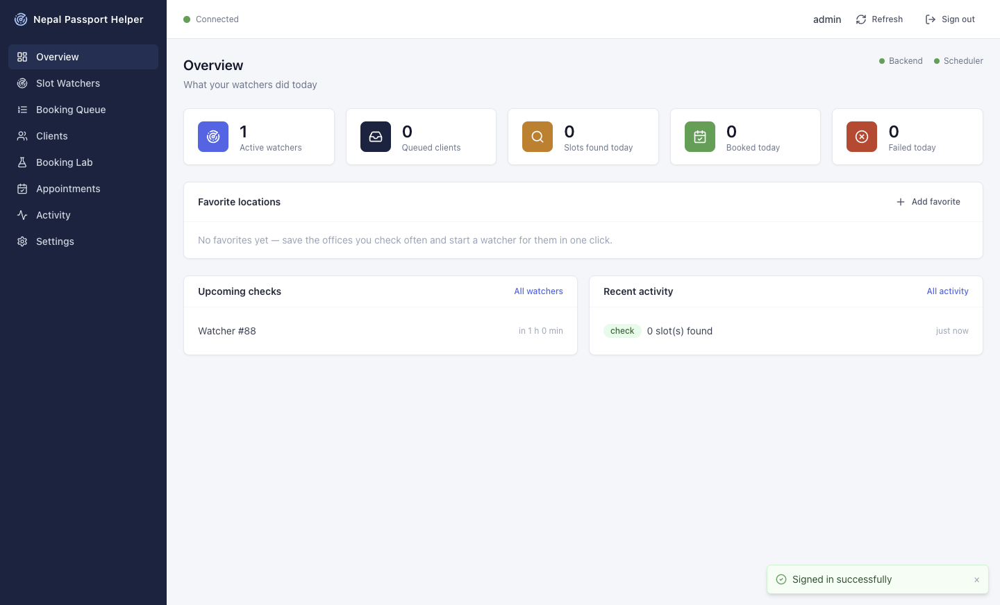
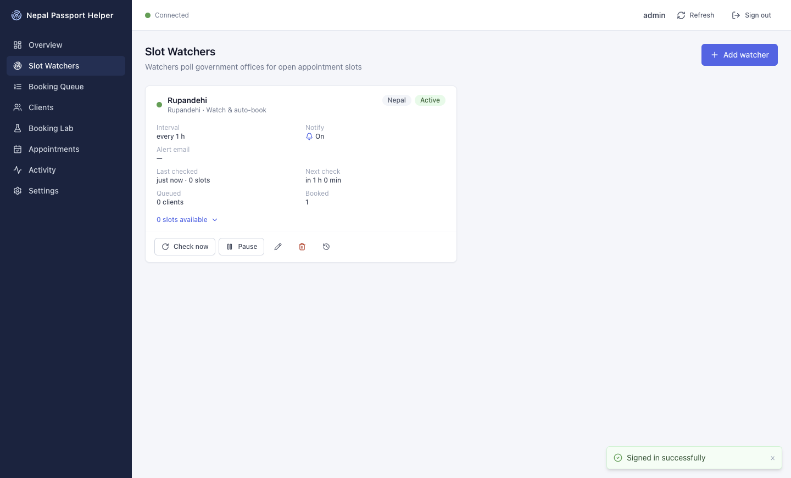
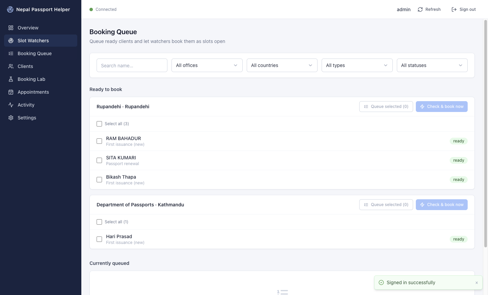
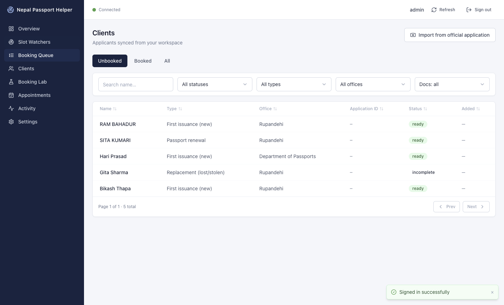
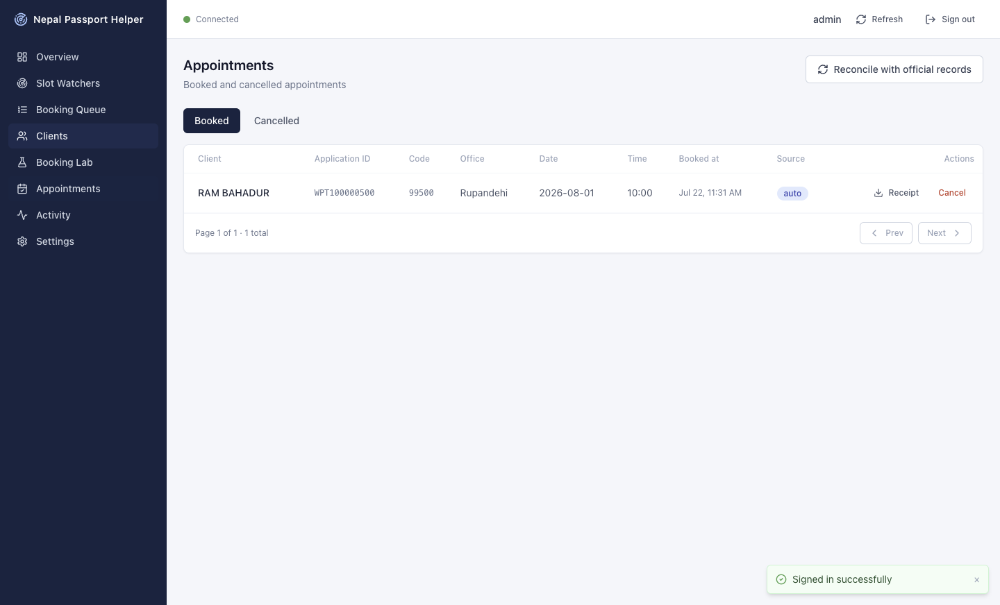
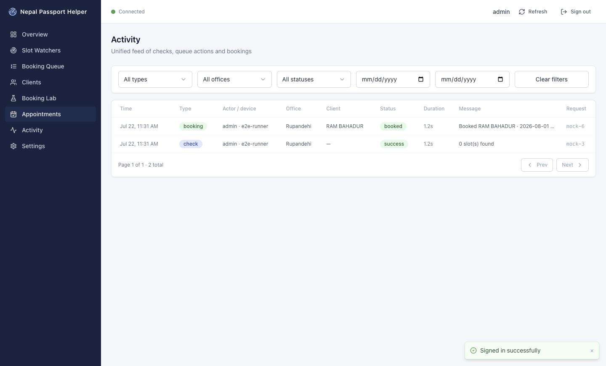
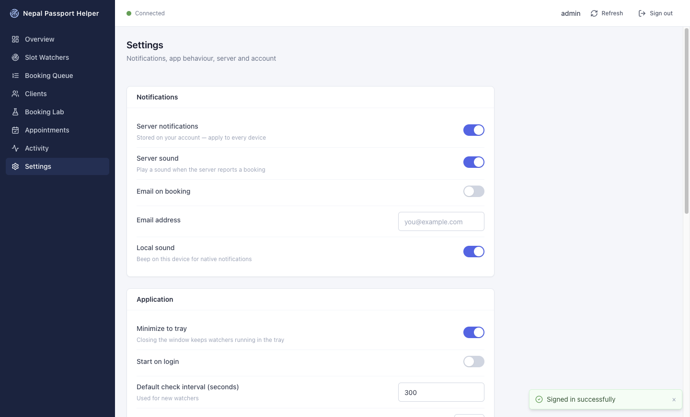

# UI walkthrough

All screenshots are captured deterministically against the e2e mock backend
(`npm run screenshots`).

## Overview

The operations dashboard: today's stats, upcoming checks with live countdowns,
recent activity, and backend/scheduler connectivity dots. A Favorite locations
card lists saved offices — add favorites via a province/district/office picker,
then start a prefilled watcher for one in a single click (or save the current
office as a favorite straight from the Add watcher dialog).

## Slot Watchers

Watcher cards with live state badges, per-card check history, slot lists, and
pause/resume/edit/delete actions. CAPTCHA and auth-expired states get
actionable banners.

## Booking Queue

Ready clients grouped by office with bulk selection, "Queue selected" and
"Check & book now" per group, plus the currently-queued list per watcher.

## Clients

Paginated, searchable, filterable client table. Row click opens a detail
drawer with the document checklist and one-click queueing.

## Import from official application

From the Clients page, **Import from official application** opens a five-step
dialog that turns an application on `online.nepalpassport.gov.np` into a client:

1. **Connect** — opens the official portal in a separate locked-down window.
2. **Sign in** — sign in on the official portal yourself (credentials and
   CAPTCHA go only to the official page), then click **I have signed in —
   Continue**.
3. **Select application** — pick one of the account's listed applications, or
   use the manual WPT ID fallback when the list is empty or the application is
   not shown.
4. **Review** — edit the mapped fields; fields that could not be mapped are
   flagged with warnings and left empty. If a client with the same citizenship
   number and date of birth already exists, a duplicate banner appears and the
   import requires the **Import anyway** checkbox.
5. **Create** — the client is created as **Fresh** with an empty document
   checklist and opens in the detail drawer (with an **Edit in web portal**
   link). No booking, receipt, or documents are created; the source WPT ID is
   not stored.

See [SECURITY.md](SECURITY.md#import-from-official-portal-srcmainofficial-importts)
for the isolation guarantees of the portal window.

## Appointments

Booked/cancelled tabs with receipt downloads (booked only — cancelled
appointments never offer receipts), cancel with confirmation, and reconcile.

## Activity

The unified audit feed: checks, queue actions, bookings, cancellations —
filterable by type, office, status and date range.

## Settings

Server notification preferences, local app behaviour (tray, login item,
polling defaults), server URL (dev only), device management and sign-out.
